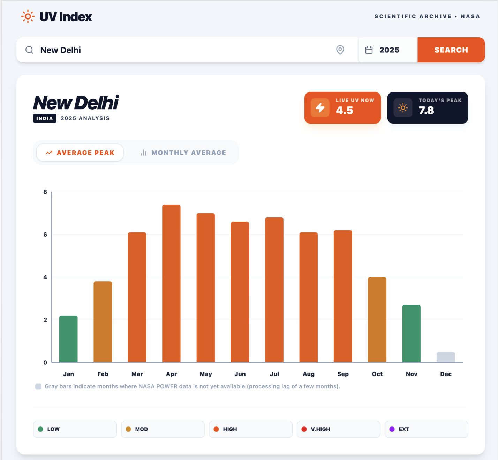

# ☀️ UV Index

**Real-time & historical UV index explorer powered by NASA POWER and Open-Meteo.**

[](https://sun.kanishkk.xyz)


[](http://www.wtfpl.net/)



---

## What it does

- **Search any city**: worldwide using autocomplete powered by the Open-Meteo Geocoding API.
- **Live UV Now**: real-time current UV index and today's peak, fetched from Open-Meteo's forecast API.
- **12-month bar chart**: monthly UV index history for any year (2016–2025) from NASA POWER's scientific archive.
- **Two view modes**: toggle between *Average Peak* (estimated clear-sky noon intensity) and *Monthly Average* (24-hour climate mean).
- **Color-coded risk levels**: Low · Moderate · High · Very High · Extreme, with safety advice on hover.
- **Data availability awareness**: months where NASA POWER hasn't published data yet are shown as gray bars with a clear explanation.
- **Recent cities**: last 5 searched cities are saved locally for quick re-access.
- **Geolocation**: detect and load your current location automatically.
- **UV Safety Guide**: built-in reference card explaining protection recommendations for each UV band.

---

## Data Sources

| Source | Used for |
|---|---|
| [NASA POWER](https://power.larc.nasa.gov/) | Monthly historical UV index archive |
| [Open-Meteo Forecast](https://open-meteo.com/) | Live UV now & today's peak |
| [Open-Meteo Geocoding](https://open-meteo.com/en/docs/geocoding-api) | City search & coordinates |
| [Nominatim (OSM)](https://nominatim.org/) | Reverse geocoding for geolocation |

---

## Getting Started

```bash
npm install
npm run dev
```

Build for production:

```bash
npm run build
```

---

## Built With AI Assistance

This project was built with the help of **[Gemini CLI](https://github.com/google-gemini/gemini-cli)** - Google's open-source AI agent that runs in your terminal.

Model used: **Auto** - Gemini CLI selects the best model for each task automatically, choosing between [`gemini-3.1-pro`](https://deepmind.google/models/gemini/pro/) and [`gemini-3-flash`](https://deepmind.google/models/gemini/flash/).

---

## License

This project is licensed under the **[WTFPL](http://www.wtfpl.net/) — Do What The Fuck You Want To Public License**.

See the [LICENSE](./LICENSE) file for the full text.
